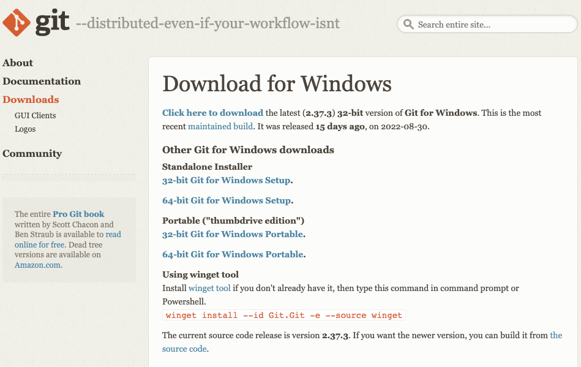
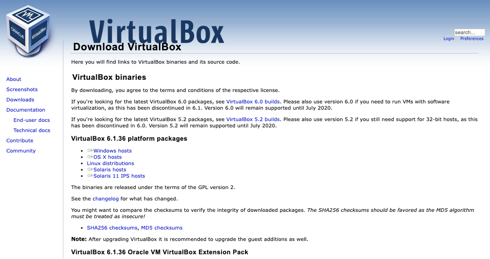
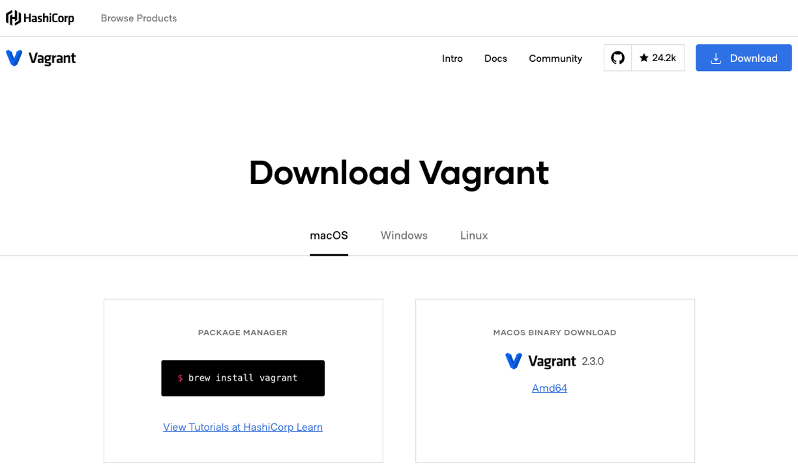
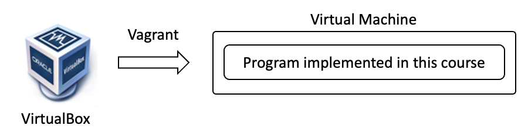
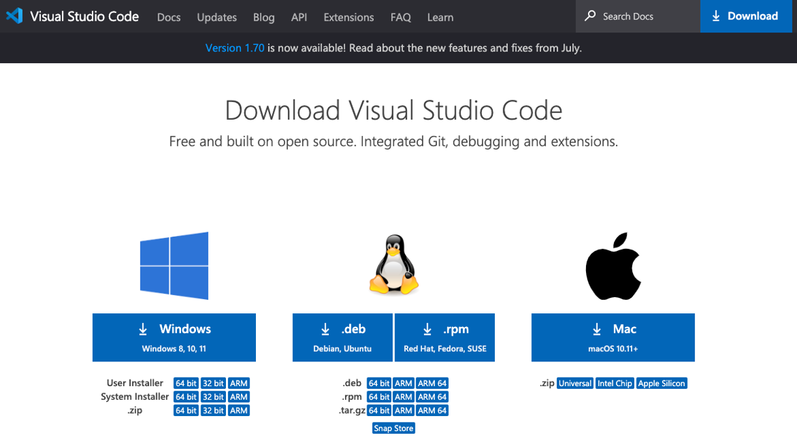
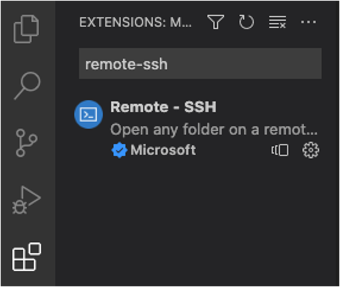
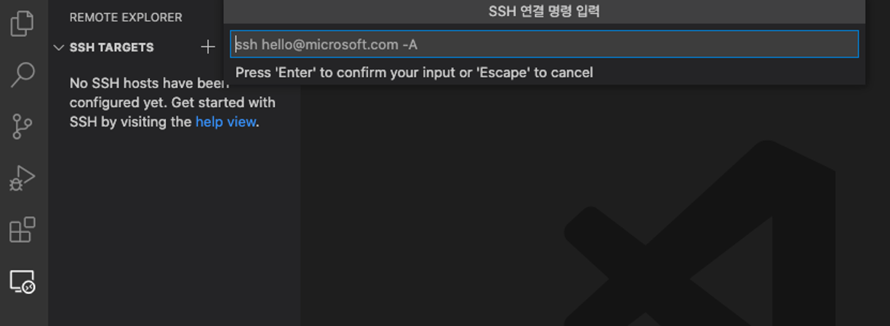

# 개발 환경 구축

- 본 과목에서는 VirtualBox, Vagrant, VSCode를 활용하여 수업을 진행함

# git

- 원활한 수업 진행을 위해 git으로 수업자료 배포함

- git 다운로드 및 설치

    - [https://git-scm.com/download/win](https://git-scm.com/download/win)

        

    - 64-bit Git for Windows Setup 다운로드 및 설치

- 수업 자료 다운로드

    - PowerShell을 열고 'DKU-APP' 디렉토리 생성

        ```
        mkdir DKU-APP
        cd DKU-APP
        ```

    - git 명령어를 통해 수업 자료 다운로드

        ```
        git clone https://git.boanlab.com/dku/308600
        ```

# Oracle VirtualBox

- x86 기반 가상화 소프트웨어
- 윈도우, 리눅스, MacOS 등의 게스트 운영체제 기반의 가상 머신 (Virtual Machine)을 생성/관리
- 무료 배포판을 제공

    ```
    주의: GPLv2 기반의 VirtualBox 바이너리를 사용해야 함!
    VirtualBox Extension Pack 사용 시 라이센스 문제로 Oracle로 부터 연락받을 수 있음!
    ```

- VirtualBox 다운로드 및 설치

    [https://www.virtualbox.org/wiki/Downloads](https://www.virtualbox.org/wiki/Downloads)

    

# Vagrant

- 가상 머신을 통해 개발 환경을 자동으로 생성/관리하게 도와주는 툴
- VirtualBox와 기본적으로 연동되며, 이 외에도 VMware Workstation/Fusion 등과도 연동 가능

- Vagrant 다운로드 및 설치

    [https://www.vagrantup.com/downloads](https://www.vagrantup.com/downloads)

    

# 개발을 위한 VM 생성 및 관리

- Vagrant를 통해 다양한 운영체제를 사용할 수 있음

    - 사용하고자 하는 운영체제 이미지 검색
    
        - [https://app.vagrantup.com/boxes/search](https://app.vagrantup.com/boxes/search)

    - 예를 들어, 우분투를 사용하고 싶다면?
    
        - [https://app.vagrantup.com/ubuntu](https://app.vagrantup.com/ubuntu)

- Vagrantfile을 통해 사용할 운영체제 이미지 명시

- Vagrant 명령어를 통해 Vagrantfile에 정의된 내용으로 VM 생성

# Vagrant 초기화

- (실습) 실습을 위한 임시 디렉토리 생성

    ```
    mkdir -p practice/01/vagrant-init
    cd practice/01/vagrant-init
    ```

    - 주의

        - Vagrant에서는 Vagrantfile이 존재하는 디렉토리가 중요함
        - 따라서, 가급적 일반 디렉토리 (예를 들어, 홈 디렉토리)는 사용하지 말 것

- (실습) Vagrantfile 템플릿 생성

    ```
    vagrant init
    ```

    - 위 명령어를 실행하면 기본 템플릿을 포함한 Vagrantfile이 생성됨

        - [Default Vagrantfile](../../practice/01/vagrant-init/Vagrantfile)

    - 필요에 따라 생성된 Vagrantfile 내용을 수정하여 사용

# Vagrantfile 작성법

- Vagrantfile 예시

    ```
    Vagrant.configure("2") do |config|
        # 사용할 운영체제 이미지 (e.g., ubuntu/focal64)
        # https://app.vagrantup.com/boxes/search에서 이미지 찾음
        config.vm.box = "vm_image"

        config.vm.provider "virtualbox" do |vb|
            # VM 이름
            vb.name = "vm_name"
            # VM에 할당할 CPU 코어 개수
            vb.cpus = 4
            # VM에 할당할 메모리 크기
            vb.memory = 8192
        end

        # VM 내에서 사용할 호스트 이름
        config.vm.hostname = "vm_hostname"

        # 만약 호스트에서 VM 내 서비스를 이용하고 싶다면?
        config.vm.network :forwarded_port, host: 8080, guest: 80

        # VM을 생성하는 과정에서 특정 명령어들을 실행하고 싶다면?
        config.vm.provision :shell, :inline => "명령어"

        # 호스트에 위치한 디렉토리를 VM 내에서 사용하고 싶다면?
        config.vm.provision "file", source: "호스트에 위치한 파일", destination: "VM 내 복사할 파일"

        # if you want to use host-side files in the VM-side,
        # you can use 'synced_folder' to do so
        config.vm.synced_folder "호스트에 위치한 디렉토리 위치", "VM 내에서의 디렉토리 위치", owner:"vagrant", group:"vagrant"

        # VM 생성 과정에서 특정 명령어 실행 후 재부팅이 필요하다면?
        config.vm.provision :reload
    end
    ```

    - 좀 더 자세한 내용이 궁금하다면?

        [https://friendsofvagrant.github.io/v1/docs/vagrantfile.html](https://friendsofvagrant.github.io/v1/docs/vagrantfile.html)

# Vagrant 명령어

- vagrant init

    - Vagrant 템플릿 생성
    - vagrant init을 실행하지 않고, 직접 Vagrantfile을 만들어도 됨

- vagrant up

    - 현재 위치의 Vagrantfile을 이용하여 VM 생성

- vagrant halt

    - VM 종료

- vagrant destroy

    - VM 삭제

- vagrant ssh

    - SSH를 통해 VM 접속

# Vagrant를 활용한 VM 생성

- (실습) VM 요구사항

    - 게스트 운영체제: Ubuntu 20.04
    - VM 이름: app-[student ID]
    - VM 호스트 이름: app-[student ID]
    - 가상 CPU 개수: 2
    - 메모리 크기: 2048 (MB)
    - 생성 중 실행할 명령어
        - sudo apt-get update
        - sudo apt-get -y install build-essential

    

- (실습) 실습을 위해 임시 디렉토리 생성

    ```
    mkdir -p practice/01/vagrant-test
    cd practice/01/vagrant-test
    ```

- (실습) Vagrantfile 생성

    - Notepad를 이용하여 Vagrantfile 생성

        - [Custom Vagrantfile](../../practice/01/vagrant-test/Vagrantfile)

    - 주의

        - 다른 자동화 툴들도 비슷하지만, 정해진 이름으로 (대소문자도 구분해서) 파일을 생성하지 않으면 정상적으로 동작하지 않을 수 있음
        - 예를 들어, Vagrantfile 이라고 하지 않고 Vagrantfile.txt로 만들면 Vagrant는 정상적으로 동작하지 않음

- (실습) Vagrant를 통해 VM 생성

    ```
    vagrant up
    ```

# Vagrant를 통해 VM 접속

- vagrant 명령어를 통해 접속

    ```
    vagrant ssh
    ```

- vagrant 명령어 말고 ssh로 VM에 접속하고 싶다면?

    - 필요한 정보 수집

        ```
        vagrant ssh-config
        ```

        - 'HostName', 'user', 'Port', 'IdentityFile' 확인
        - 특히, 'IdentityFile'은 따로 복사해 둠

    - SSH를 통해 가상 머신에 접속

        ```
        ssh -p [Port] -i [IdentityFile] [user]@[HostName]
        ```

- 만약 SSH Timeout 에러가 뜬다면?

    - Vagrant SSH Key값 업데이트

        ```
        curl -O https://raw.githubusercontent.com/mitchellh/vagrant/master/keys/vagrant.pub
        ```

# 일반적으로 프로그래밍에 사용하는 툴

- 고전적인 툴

    - Vi
    - Emacs

- GUI 기반 IDE (Integrated Development Environment)

    - CLion for C, C++
    - Eclipse, IntelliJ for Java
    - Pycharm for Python

- GUI 기반 통합 코드 에디터

    - VSCode

# Visual Studio Code

- VSCode 다운로드 및 설치

    [https://code.visualstudio.com/download](https://code.visualstudio.com/download)

    

# VSCode Extension

- VSCode provides lots of extensions

    - C/C++ Compiler, Java extension pack, Golint, and so on

- Remote - SSH

    - Allows accessing a remote host and working at the remote host

- Let's install 'Remote - SSH'

    - Search 'Remote - SSH' and install it

        

# VSCode를 통해 VM 접속

- Click 'Remote Explorer' and Click '+'

    

    - SSH를 통한 VM 접속 명령얼 입력

        ```
        ssh -p [Port] -i [IdentityFile] [user]@[HostName]
        ```

        - 필요한 정보는 다른 터미널에서 아래와 같이 실행하여 관련 정보를 얻을 수 있음

            ```
            vagrant ssh-config
            ```

            - 'HostName', 'user', 'Port', 'IdentityFile' 확인

- Click 'Explorer' from the new Window and Click 'Open Folder'

    - VSCode에서 사용할 디렉토리 선택

# 개발 환경 검증

- 간단히 HelloWorld 프로그램 작성

    - Open a terminal

        - [View] - [Terminal]

        - 참고) 개발 과정 중 굳이 새로운 터미널 창을 열 필요없이 VSCode에서 제공하는 터미널을 사용하면 편리함

    - Create a test directory

        ```
        mkdir practice/01/helloworld
        cd practice/01/helloworld
        ```
    
    - Open the test directory

        - [Explorer] - [Open a Folder]

    - Create a new file, named 'helloworld.c'

        ```
        #include <stdio.h>

        int main() {
            printf("HelloWorld\n");
            return 0;
        }
        ```

    - Compile the program in the Terminal

        ```
        gcc -o helloworld helloworld.c
        ./helloworld
        ```
