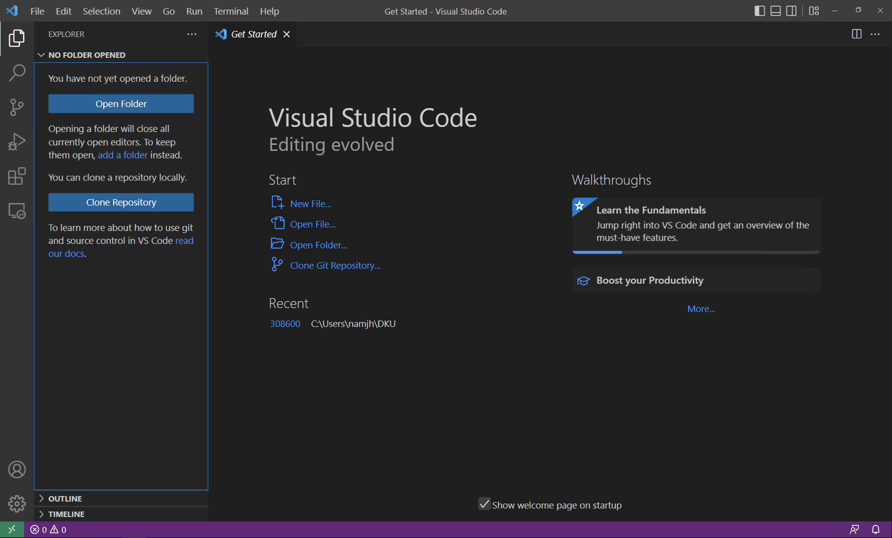

# 수업 전 확인 사항

- 지난 시간 세팅하였던 VirtualBox + Vagrant가 정상적으로 동작하는지 확인 할 것!

- 'vagrant up' 했을 때 문제가 있었던 PC라면, 다른 자리로 이동하여 다시 세팅하는 할 것!

- 실습실 컴퓨터가 아니더라도 개인 노트북을 사용하는 것도 무방하니 Vagrant 환경을 갖출 것!

# 수업 후 주의 사항

- 수업이 끝나고 자리를 떠날 때, 꼭 'vagrant destory'를 실행해서 사용하던 VM을 지우고 갈 것!

    ```
    vagrant destroy
    ```

# 수업 준비

- 앞으로의 내용은 생성된 VM 안에서 진행됨

    1. VSCode 실행

    2. [Explorer] 클릭

        

    3. [Open Folder] 클릭 후 308600 디렉토리를 찾아 폴더 선택

    4. [View] - [Terminal]을 클릭하여 PowerShell을 띄움

    5. VSCode 내 PowerShell에서 아래의 명령어를 실행
    
        - 수업 진행을 위해 Vagrant를 이용하여 VM 생성

            ```
            vagrant up
            vagrant ssh
            ```

        - 따로 Vagrantfile을 생성하지 않고, 기준 디렉토리에 위치한 Vagrantfile을 이용하여 VM 생성함

# 수업 내용

- [Makefile](make.md)
- [Command-line Arguments](command-line-arguments.md)
- [Function Pointer](function-pointer.md)
