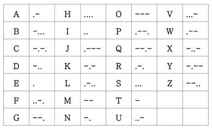

# 모스 코드 (Morse Code)

- Morse Code는 아래 테이블에 보이는 것처럼 영문자 'A' 부터 'Z' 까지를 각각 점(.)과 대쉬(-)의 조합으로 인코딩한 것입니다.

  As shown in the table below, Morse Code encodes English letters 'A' to 'Z' with a combination of a dot (.) and a dash (-), respectively.

    

- String 하나를 입력 받아 이를 Morse Code로 인코딩하는 기능과 Morse Code를 입력 받아 이를 영문 대문자 String으로 디코딩하는 기능을 수행하는 프로그램을 작성하세요.

  Write a program that receives a String input and encodes it into Morse Code, and receives Morse Code input and decodes it into an English uppercase string.

# 입력 (Input)

- 입력은 한 줄 이상의 String으로 구성되어 있습니다.

  Input consists of one or more lines of String.

- 입력의 각 줄은 40글자를 넘지 않습니다.

  Each line of input should not exceed 40 characters.

- 입력 형식은 다음과 같이 세가지 형태로 분류됩니다.

  The input format is classified into three types as follows.

    ```
    "E     string        other strings <Enter>"      -> Encodes the string and prints it out.
    "D        Morsecode       other strings <Enter>" -> Decodes the corresponding string and prints it out.
    "Q<Enter>"                                       -> Terminates the program.
    ```

- String은 알파벳으로만 구성된 문자열이며, 대소문자를 구분하지 않습니다.

  String is an alphabetical string, case insensitive.

- Morse Code는 코드와 코드 사이에 #이 삽입된 인코딩된 문자열입니다.

  Morse Code is an encoded string with # inserted between codes.

- E와 String 사이, D와 Morse Code 사이에는 임의의 개수의 white char(스페이스, 탭)가 삽입되어 있습니다.

  An arbitrary number of white chars (spaces, tabs) are inserted between E and String and between D and Morse Code.

- Morse Code로 인코딩할 때 코드와 코드 사이에는 #을 하나 삽입합니다.

  When encoding with Morse Code, insert one # between each code.

- 처음 String 또는 Morse Code 이후 추가적으로 입력되는 문자열이 있을 경우 이들은 모두 무시합니다.

  If there are additional input strings after the first String or Morse Code, they are all ignored.

# 출력 (Output)

- 예제 입력 (Sample Input)

    ```
    E heLLO world
    D ....#.#.-..#.-..#--- 
    E DEL space
    E Abcd efg hij etc
    D -..#.#.-..
    Q
    ```

- 예제 출력 (Sample Output)

    ```
    ....#.#.-..#.-..#---
    HELLO
    -..#.#.-..
    .-#-...#-.-.#-..
    DEL
    ```
